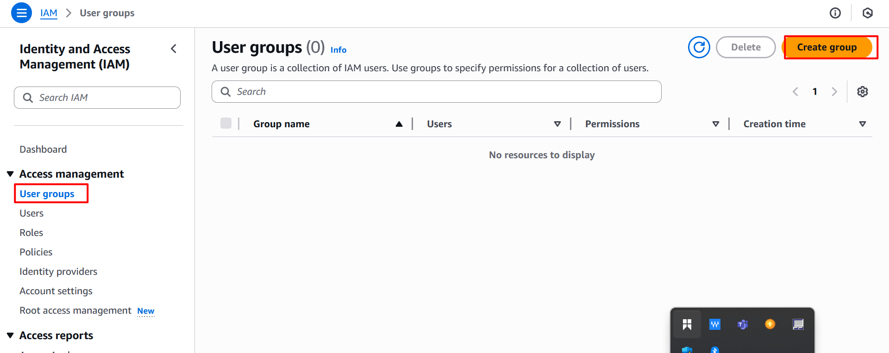
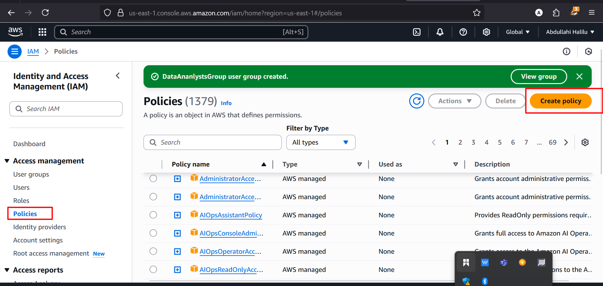
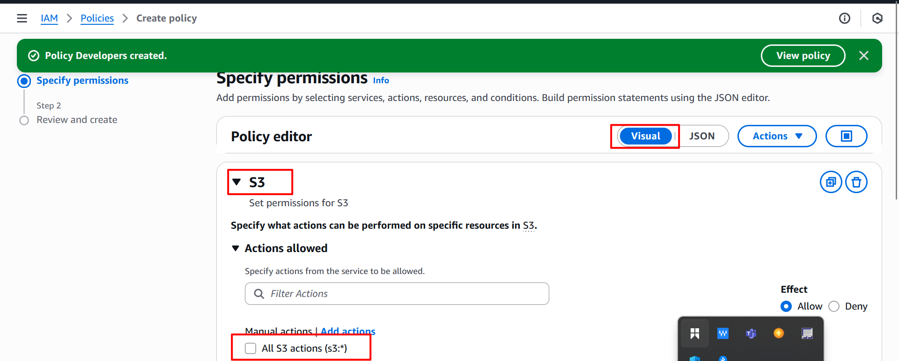
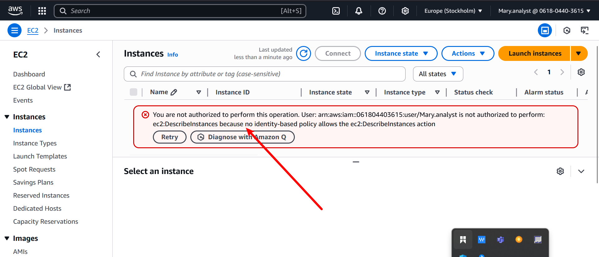
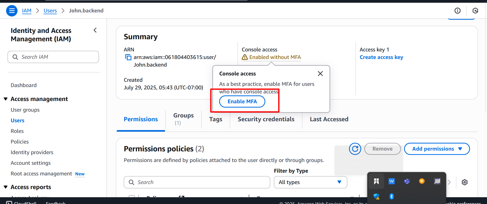

# Hands_On_project_Aws
in this project, we showcase how you can successfully build IAM user management for Zappy e-Bank, including scalable access setup for backend developers (like John) and data analysts (like Mary). Below is a step-by-step process:

## Log into AWS console
1. search for IAM and click on it
.

## Create IAM Group with Attach policies .
This allows you to manage permissionfor roles, and simply add user to the right group.

1. Create Group for BackendDevGroup.
- Go to your IAM Dashboard, click on userGroup and create group

- Name it BackendDevGroup
.

2. Follow the same proceedure to create anaother group for DataAnalystGroup.

## Create Policy for BackendGroup.

1. In the IAM console , click on policies and create policy.
.

2. In the select a service section, search for EC2. And for simplicity select the "All EC2 Action" 
.

3. Also, select "ALL" In the resources section, and click next.
.

4. Give it a name "Developers". And click on create policy.
.

5. Checking the policy. when you search for developers , you see that you are the one managing The policies of the group unlike the others which are being managed by the AWS,
.

## Create policy For the DataAanalystGroup
1. Repeat the same process abaove for DataAnalyst, but instead of EC2, search for S3.Also named the policy Analyst instead of Developers.
.

## Attach policy Created to The BackendDevGroups
This will allow users in the BackendDevGroup to have access to EC2 instances.
1. Go to user group and select BackendDevGroup.
.

2. Move to permission and click on add permission and select attach policies.
.

3. In the search cullumn, search for developers, select it and click attach policy.
.

4. you have successfully created a group and attach permission policies to any user in the group.
.

## Creating IAM user and Assign to the Group
Lets create users John and mary.

A. Create user john and Add to BackendDevGroup.
1. Go to user and click on add user
.

2. provide name for the user "john.backend" in this case and select access type 'Aws management console. set a custom password.
.

3. On permission screen: choose add user to the group and select BackendDevGroup.
.

click create. you successfully create a user and add the user to the group.

4. Repeat the same proceedure to create user mary. But mary is Data analyst, so she should be added to the DataanalystGroup.

# Testing and Validation.

## Testing John Access; 
1. log in as john into the Aws management console to ensure he has the correct access.
.

2. in the Dashboard search bar, search for EC2 .

3. check if john can start and stop instance.
.

4. Launch instance
.

## Testing mary's Access
1. log in as mery but in the dashboard search bar search for s3.
.

2. perform s3 action to create s3 bucket. click create bucket and provide a name .
.

3 click create bucket
.

## checking Role for both users
1. in the mary search bar , search for Ec2, you see that maty is not authorize to perform such operation.
.

2. Go to john dashboard and search for s3 or create a bucket , you see that john is not authorize to perform such acttion.
.

# Creating Multi-Factor Authentication(MFA).

## Setting up MFA For John;
1. click on user and click on john.
.

2. click on enable MFA .
.

3. Enter a device name for john MFA and select Authentication App.
.
Note; you need to install authenticator app on your mobile device.

4. click on next and open the authenticator app on your mobile device to scan the  QR Code. Then you can fill in the two consecutive .
.

5. By completing these steps MFA will be enable for john.

## setting MFA for mary.
1. Repeat the same step for mary.
